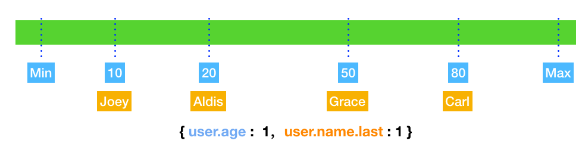
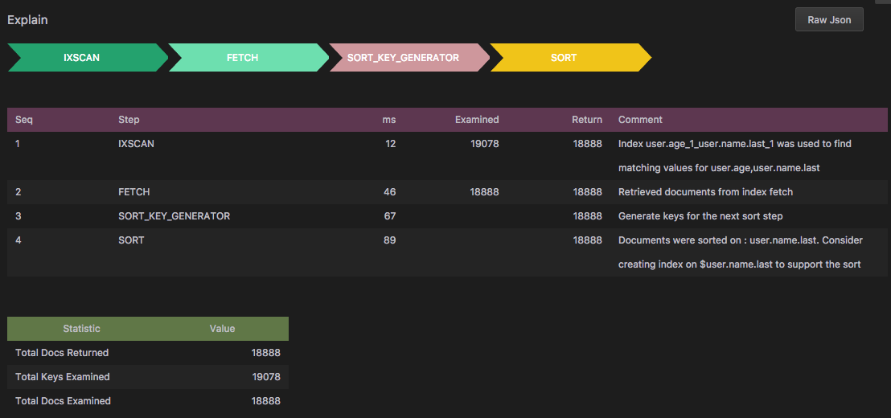
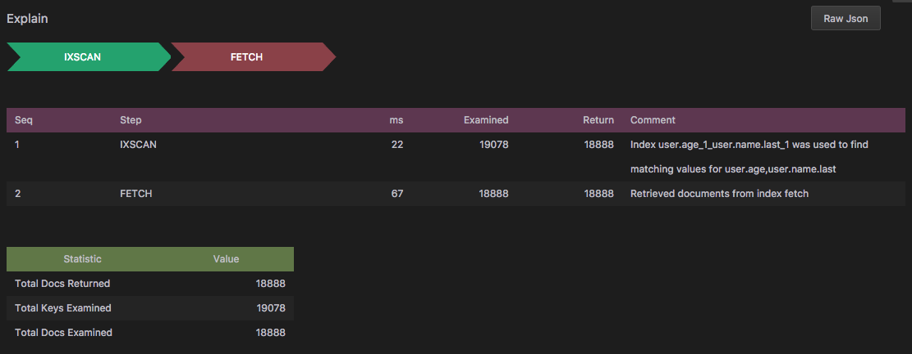

# 通过Explain来分析MongoDB查询性能

最近分析了一些MongoDB的性能问题，发现MongoDB自带的Explain有很强大的分析功能。根据Explain的运行结果可以得到find语句执行过程中每一个步骤的执行时间以及扫描Document所使用得索引细节。下面我们根据几个具体的场景来分析如何利用explain了解语句执行的效率，如何通过创建索引提高find语句的性能。

## MongoDB 索引

每当大家谈到数据库检索性能的时候，首先提及的就是索引，对此，MongoDB也不例外。就像大家读一本书，或者查字典一样，索引是书的目录，让你方便的能够在上百页的书中找到自己感兴趣的内容。那么，有多少人了解索引的底层原理呢？相信大部分人，至少与数据库打过交道的都知道如何使用，但是牵扯到底层的技术实现可能研究过的人就不多了。在此我给大家一个MongoDB索引的底层实现原理分析，之后会根据一个具体实例来看看如何通过索引提高collection的检索性能。

在没有创建任何索引的collection中，MongoDB会对查询语句执行一次整体扫描，这个过程在MongoDB中叫 `collection scan`。`collection scan` 会根据查询语句中的检索条件，与collection中每一个document进行比较，符合条件的document被选出来。可以想像，对一个包含几百万条纪录数据库表来说，查询的效率会相当底，执行时间也会很长。就像你在一个没有目录的书中查找一段相关内容一样，也许你会快速浏览这本书的每一页，才能找到想要的结果。对于有索引的collection来说，情况会好很多。由于创建了索引，MongoDB会限制比较的纪录个数，这样大大降低了执行时间。

## B-tree

MongoDB采用B-tree作为索引数据结构，B-tree数据结构的基本概念并不在本篇文章所要讨论的范围之内，有兴趣的读者可以查阅一些相关文章和书籍。在MongoDB里面，B-tree中的一个节点被定义成一个Bucket。Bucket中包含一个排过续的数组，数组中的元素指向document在collection中的位置。如下图所示：


假设我们有一个叫User的数据库表，里面有两个字段，Name和Age。每条记录的位置由Row表示。在左边这张图上，每一条索引记录包括一个索引主键（Name）以及一个指向User表中记录的引用。通过这个引用，我们可以找到记录在Collection中的位置。例如：如果你想找到所有叫Carl的用户，通过引用的位置我们可以得到5，1000，1001，1004四个匹配的纪录位置。

## 索引的种类

MongoDB支持多种索引类型，常用的有`Single Field`， `Compound Index`， `Multikey Index`， `Text Indexes`， `Hashed Indexes`，等。这里我就不对每一种Index做过多的解释了，有兴趣的读者可以参考MongoDB官方文档：[Indexes-Basics](https://docs.mongodb.com/manual/indexes/#Indexes-Basics)。

## Explain使用方法
上面介绍了一下MongoDB索引的基本结构以及存储类型，接下来我们看看如果使用索引来提高检索性能。本文不是一个入门级文章，关于explain的基本用法、参数等信息可以参考MongoDB的官方文档：[link to Expalin Results!](https://docs.mongodb.com/manual/reference/explain-results/)
我们知道Explain支持三种执行参数，`queryPlanner`, `executionStats` and `allPlansExecution`， 他们之间具体的区别可以参考上面列出的文档，为了进行详细的性能分析，本文不考虑使用`queryPlanner`, 而另外两个参数的执行没有太多区别，所以本文只采用`executionStats`。

## 准备数据

首先准备数据，在学习如何分析数据库性能的同时，我们最头疼的莫过于如何准备数据，如何模拟数据的执行效率。幸运的是mtools([Link to mtools](https://github.com/rueckstiess/mtools))为我们提供了方便的MongoDB实例化，以及插入任意格式的json数据结构。(截止到目前为止，mtools的官方release还不支持windwos操作系统，但是我的一个PR已经merge到master，所以使用windows的同学可以直接从master上面手动安装mtools，需要python2.7的支持)。
运行下面的`mlaunch`命令来启动一个MongoDB 单例server(他会启动一个监听27017端口的server，如果可以设置不同的参数来使用其他端口）：

`mlaunch init --single `

数据库启动以后，我们来创建一些用于测试的json数据，定义下面的json格式：

```json
{
    "user": {
        "name": {
            "first": {"$choose": ["Liam", "Noah", "Ethan", "Mason", "Logan", "Jacob", "Lucas", "Jackson", "Aiden", "Jack", "James", "Elijah", "Luke", "William", "Michael", "Alexander", "Oliver", "Owen", "Daniel", "Gabriel", "Henry", "Matthew", "Carter", "Ryan", "Wyatt", "Andrew", "Connor", "Caleb", "Jayden", "Nathan", "Dylan", "Isaac", "Hunter", "Joshua", "Landon", "Samuel", "David", "Sebastian", "Olivia", "Emma", "Sophia", "Ava", "Isabella", "Mia", "Charlotte", "Emily", "Abigail", "Avery", "Harper", "Ella", "Madison", "Amelie", "Lily", "Chloe", "Sofia", "Evelyn", "Hannah", "Addison", "Grace", "Aubrey", "Zoey", "Aria", "Ellie", "Natalie", "Zoe", "Audrey", "Elizabeth", "Scarlett", "Layla", "Victoria", "Brooklyn", "Lucy", "Lillian", "Claire", "Nora", "Riley", "Leah"] },
            "last": {"$choose": ["Smith", "Jones", "Williams", "Brown", "Taylor", "Davies", "Wilson", "Evans", "Thomas", "Johnson", "Roberts", "Walker", "Wright", "Robinson", "Thompson", "White", "Hughes", "Edwards", "Green", "Hall", "Wood", "Harris", "Lewis", "Martin", "Jackson", "Clarke", "Clark", "Turner", "Hill", "Scott", "Cooper", "Morris", "Ward", "Moore", "King", "Watson", "Baker" , "Harrison", "Morgan", "Patel", "Young", "Allen", "Mitchell", "James", "Anderson", "Phillips", "Lee", "Bell", "Parker", "Davis"] }
        }, 
        "gender": {"$choose": ["female", "male"]},
        "age": "$number", 
        "address": {
            "street": {"$string": {"length": 10}}, 
            "house_no": "$number",
            "zip_code": {"$number": [10000, 99999]},
            "city": {"$choose": ["Manhattan", "Brooklyn", "New Jersey", "Queens", "Bronx"]}
        },
        "phone_no": { "$missing" : { "percent" : 30, "ifnot" : {"$number": [1000000000, 9999999999]} } },
        "created_at": {"$date": ["2010-01-01", "2014-07-24"] },
        "is_active": {"$choose": [true, false]}
    },
    "tags": {"$array": {"of": {"label": "$string", "id": "$oid", "subtags": 
        {"$missing": {"percent": 80, "ifnot": {"$array": ["$string", {"$number": [2, 5]}]}}}}, "number": {"$number": [0, 10] }}}
}
```
把它保存为一个叫`user.json`的文件中，然后使用`mgenerate`插入十万条随机数据。随机数据的格式就按照上面`json`文件的定义。你可以通过调整 `--num`的参数来插入不同数量的Document。([Link to mgenerate wiki](https://github.com/rueckstiess/mtools/wiki/mgenerate))

`mgenerate user.json --num 1000000 --database test --collection users`

上面的命令会像`test`数据库中`users` collection插入一百万条数据。在有些机器上，运行上面的语句可能需要等待一段时间，因为生成一百万条数据是一个比较耗时的操作，之所以生成如此多的数据是方便后面我们分析性能时，可以看到性能的显著差别。当然你也可以只生成十万条数据来进行测试，只要能够在你的机器上看到不同find语句的执行时间差异就可以。

连接到MongoDB查看一下刚刚创建好的数据：

```javascript
> use test
switched to db test
> db.users.count()
100000
> db.users.findOne()
{
	"_id" : ObjectId("59c6f5a52d89b6bcb930f8dd"),
	"user" : {
		"name" : {
			"last" : "Clark",
			"first" : "Abigail"
		},
		"gender" : "female",
		"created_at" : ISODate("2012-11-21T01:41:52Z"),
		"is_active" : true,
		"phone_no" : NumberLong("5739256314"),
		"address" : {
			"city" : "Brooklyn",
			"house_no" : 8,
			"street" : "49k4XytAi2",
			"zip_code" : 95372
		},
		"age" : 55
	},
	"tags" : [
		{
			"id" : ObjectId("59c6f5a52d89b6bcb930f8d7"),
			"label" : "fODYJ4u563"
		},
		{
			"id" : ObjectId("59c6f5a52d89b6bcb930f8d8"),
			"label" : "yKovbVfvvX"
		},
		{
			"id" : ObjectId("59c6f5a52d89b6bcb930f8d9"),
			"subtags" : [
				"k1joSrnyfM",
				"B0cmItGVpL",
				"nICDbstkPp",
				"v6qS6cHOXP",
				"qYpS77eaK9"
			],
			"label" : "lVekRR4ZP7"
		},
		{
			"id" : ObjectId("59c6f5a52d89b6bcb930f8da"),
			"label" : "xEXILC407J"
		},
		{
			"id" : ObjectId("59c6f5a52d89b6bcb930f8db"),
			"label" : "ZBQLySNl2C"
		},
		{
			"id" : ObjectId("59c6f5a52d89b6bcb930f8dc"),
			"label" : "ul38gOzU0F"
		}
	]
}
```
对于不太熟悉Mongo Shell的同学，不要着急，这里我为大家推荐一款强大的MongoDB IDE，[Link to dbKoda](https://www.dbkoda.com)，这款IDE可以替代Mongo Shell全部功能，并且提供了图形化的方式来查看MongoDB的各种性能指标。例如下面显示了`users` collection的数据结构：


数据创建好以后，我们就完成了所有的准备工作。

## 分析查询语句性能分析

连接到MongoDB以后，我们执行一些基本的`find`操作看看效率如何。比如，我想查找所有未到上学年龄的学生的纪录，例如下面的语句很快就返回了希望的结果：

```javascript
> db.users.find({'user.age': {$lt: 6}})
{ "_id" : ObjectId("59c6f94f2d89b6bf8589b48a"), "user" : { "name" : { "last" : "Moore", "first" : "Scarlett" }, "gender" : "female", "created_at" : ISODate("2011-06-25T14:36:20Z"), "is_active" : false, "phone_no" : NumberLong("3333709112"), "address" : { "city" : "Manhattan", "house_no" : 15, "street" : "9pBg597nKi", "zip_code" : 29238 }, "age" : 2 }, "tags" : [ { "id" : ObjectId("59c6f94f2d89b6bf8589b480"), "label" : "4ZN2hWZJP3" }, { "id" : ObjectId("59c6f94f2d89b6bf8589b481"), "label" : "gRPeo6XBjo" }, { "id" : ObjectId("59c6f94f2d89b6bf8589b482"), "label" : "aextSOQv87" }, { "id" : ObjectId("59c6f94f2d89b6bf8589b483"), "label" : "NSfDgF13Uv" }, { "id" : ObjectId("59c6f94f2d89b6bf8589b484"), "label" : "n1QCe3lOD7" }, { "id" : ObjectId("59c6f94f2d89b6bf8589b485"), "subtags" : [ "tUdGTT45LY", "cJeDGQiHBj", "OCw2pvOBNb", "qu76tG3lDu" ], "label" : "gXEHiBCrUd" }, { "id" : ObjectId("59c6f94f2d89b6bf8589b486"), "subtags" : [ "gJ73WzviVH", "AQJK6A2oAd", "HK9SKGeA79" ], "label" : "w9vM389N9t" }, { "id" : ObjectId("59c6f94f2d89b6bf8589b487"), "label" : "rTVpvz0Rst" }, { "id" : ObjectId("59c6f94f2d89b6bf8589b488"), "label" : "yADOw9SmHb" }, { "id" : ObjectId("59c6f94f2d89b6bf8589b489"), "label" : "tft9uFBU5y" } ] }
...
```
可能你看不出来这条语句具体执行了多长时间，以及执行的过程中扫描了多少个文档，此时强大的`explain`就派上用场了，你可以在上面的语句中加上 `.explain("executionStats")`，会得到json格式的`explain`输出。

```javascript
> db.users.explain('executionStats').find({'user.age': {$lt: 6}})
{
	"queryPlanner" : {
		"plannerVersion" : 1,
		"namespace" : "test.users",
		"indexFilterSet" : false,
		"parsedQuery" : {
			"user.age" : {
				"$lt" : 6
			}
		},
		"winningPlan" : {
			"stage" : "COLLSCAN",
			"filter" : {
				"user.age" : {
					"$lt" : 6
				}
			},
			"direction" : "forward"
		},
		"rejectedPlans" : [ ]
	},
	"executionStats" : {
		"executionSuccess" : true,
		"nReturned" : 59279,
		"executionTimeMillis" : 493,
		"totalKeysExamined" : 0,
		"totalDocsExamined" : 1000000,
		"executionStages" : {
			"stage" : "COLLSCAN",
			"filter" : {
				"user.age" : {
					"$lt" : 6
				}
			},
			"nReturned" : 59279,
			"executionTimeMillisEstimate" : 447,
			"works" : 1000002,
			"advanced" : 59279,
			"needTime" : 940722,
			"needYield" : 0,
			"saveState" : 7831,
			"restoreState" : 7831,
			"isEOF" : 1,
			"invalidates" : 0,
			"direction" : "forward",
			"docsExamined" : 1000000
		}
	},
	"serverInfo" : {
		"host" : "dyn-103-35-230-143.its.monash.edu.au",
		"port" : 28017,
		"version" : "3.4.0",
		"gitVersion" : "f4240c60f005be757399042dc12f6addbc3170c1"
	},
	"ok" : 1
}
```

在Mongo Shell中浏览这些输出也许不是一件令人愉快的行为，全部文本界面，没有高亮提示，不能查询等等都是困扰我们的地方。幸运的是`dbKoda`这款强大的IDE为我们提供了可视化的分析方法。好打开`dbKoda`,输入上面的`find`，然后运行工具栏中的问号，选择`Execution Stats`，会看到下面的输出结果：


我来对这个输出进行一些解释。
这个`find`方法包含了一个`explain step`，`COLLSCAN`，共有59279个符合条件的Document，为了找出这些Document我们需要扫描一百万条记录，总共耗费的时间是479毫秒。熟悉MongoDB的同学们可能都会比较清楚，`COLLSCAN`是我们尽量避免的查询过程，因为他会对整个Collection进行一次全盘扫描，很多时候只是为了得到很少量的数据。正如上面的例子那样，为了得到六万条记录，我们需要检索全部一百万条Document，可以不客气的说，这样的数据库设计是一个很糟糕的实践，因为我们进行了90多万次多余的检索比较。

没关系，对于初学者来说这正好是一个学习最佳实践的好机会。我会一步一步的告诉大家如何提高检索的效率。

## 通过创建索引提高检索性能

刚才执行的`find`操作是针对用户年龄进行的，下面我们就对这个字段创建一个索引，我对Mongo Shell的命令不是很熟悉，所以下面的操作都是在`dbKoda`上进行。右键单机想要创建索引的Collection，点`Create Index`打开创建索引界面，在上面选择希望创建索引的字段，这里的选择是`age`，如下图。当你在左边的界面上进行选择的时候，右边直接会出现对应的Mongo Shell命令，真的是非常方便。


点击`Execute`按钮，创建成功后，刷新一下左边的Tree View，会看到新建的索引已经显示在界面上了，`user.age_1`。

接下来我们再进行一遍刚才同样的`explain`操作：


可以看到，新的结果里面包含了两次step。`IXSCAN`和`FETCH`。
* `IXSCAN`：在explain表格中可以看到，`IXSCAN`耗时33毫秒，扫描了59279个记录，并返回了59279条记录。在Comment列看到他使用了刚刚创建的`user.age_1`索引。
* `FETCH`：耗时118毫秒，将`IXSCAN`返回的纪录全部获取出来。

两个step总共耗时151毫秒，对比，刚才的479毫秒提高了将近70%。

## 理解组合检索条件的Explain

经过前面的优化以后，你可能对MongoDB的Index有了一定的了解，现在我们可以看一下在进行多个检索条件的时候如何查看他们的执行性能。

在刚才的检索基础上，我们加一个用户姓名条件：
`db.users.find({'user.age': {$lt:6}, 'user.name.last':'Lee'})`。下面是这个检索语句的Explain输出：

同样是出现了两次Step，`IXSCAN`和`FETCH`，`IXSCAN`的返回结构和上次也是一样的，59279条记录。不同的是，这次`FETCH`返回了1204条记录，过滤了 `59279 - 1204 = 58075`条，也就是说浪费了58075次Document检索。为什么会出现这样的情况？我们再来检查一下检索条件，上面包括两个逻辑与关系的条件，一个是用户年龄小于6岁，另一个是用户姓名叫`Lee`。对于第一个条件，我们已经知道，符合的纪录数是59279，并且我们已经为用户年龄创建了一条索引，所以第一个`IXSCAN`没有任何不同。但是我们并没有对用户姓名做索引，所以第二个`FETCH`语句在59279条记录的基础上在此进行一次扫描，在符合年龄的用户中过滤掉不叫`Lee`的用户。此时，你可能会意识到`58075`这个数字是如何来的。看看下面的命令输出： 
```javascript
> db.users.find({'user.age': {$lt: 6}, 'user.name.last': {$ne:'Lee'}}).count()
58075
```
查询年龄在6岁以下，姓名不叫Lee的用户数正好是58075。这样我们就清楚了这次Explain的结果。并且，聪明的你应该知道如何创建索引来解决这个多余的58075次比较了吧。在看下面的语句之前，我建议你现在自己的环境下运行一下你的索引，争取把这个58075变成0。

如果你创建了下面的索引：
`db.users.createIndex({'user.name.last':1})`

然后对刚才的语句执行一次Explain，可能得到的并不是你想要的结果：


可以看到这次的结果同样是两个Step，并且第一个`IXSCAN`用的Index是刚刚创建的用户姓名(这一点可以通过Step Comment中看到），并不是年龄和用户姓名的组合。这是为什么呢？原因是MongoDB不会自动组合索引，我们刚才创建的只是两个独立的索引，一个是`user.age`, 一个是`user.name.last`；也就是说，我们需要创建一个用户年龄和姓名的组合索引。

`db.users.createIndex({'user.age': 1, 'user.name.last':1'})`

然后对查询语句执行Explain操作如下：


基本上整个执行过程的耗费时间是0ms，可以说这样的检索算是一个非常好的索引查询。

通过上面的例子大家会对组合索引有一些了解，那么组合索引和单字段索引的区别在哪里呢？

对于一个基于年龄的索引来说，`{'user.age': 1}`, MongoDB对这个字段创建一个生序的索引排序，索引数据放到一个年龄轴上，会是下面显示的样子：


你也可以创建一个降序的索引，`{'user.age': -1 }`，但是对于单字段索引来说，生序和降序对性能没有任何影响因为MongoDB可以按照任何方向检索数据。

在组合索引的情况下，结构比单字段索引要复杂一些，以上面的索引为例，`db.users.createIndex({'user.age': 1, 'user.name.last':1'})`，如下图所示：


浅蓝色部分是`user.age`索引字段，橘黄色指的是`user.name.last`字段，可以看到MongoDB会把索引中的字段组合在一起创建。其中有一点与单字段索引不同的是生序和降序。刚才提到在单字段索引中，升降序并不会影响检索的性能，但是在组合索引的情况下，升降序的设置对排序`sort`有很大的影响。

首先是索引字段的顺序，当我们创建一个组合索引时，`{'user.age': 1, 'user.name.last':1}`, 里面的两个索引字段`user.age`和`user.name.last`的顺序要和`sort`语句中的顺序保持一致。例如：这样的排序顺序是不能被索引所覆盖到的：`.sort{'user.name.last':1, 'user.age':1}`，原因是字段的前后顺序和创建的索引不同。看一下这个查询语句的Explain结果就清楚了：`db.users.find({'user.age': {$gt: 5}, 'user.name.last': 'Lee'}).sort({'user.name.last':1, 'user.age': 1})`。找到姓名叫Lee并且年龄大于5岁，并且按照姓名和年龄生序排序，得到下面的explain输出：



在Explain输出中我们可以看到共有4个执行步骤，前两个大家已经清楚了，一个是索引查询，另一个是获取查询到的纪录。那么从第三个开始就是我们的排序语句的执行步骤，生成用来排序的key，并进行排序。从排序的Comment中可以看到`dbKoda`建议我们为`user.name.last`创建索引，但是我们明明已经创建过索引，为什么还提示创建呢，其实这就是创建索引时字段的顺序在影响我们的执行结果。很显然，后面两个排序的步骤是多余的。那如果我们按照索引的顺序来执行会得到什么样的结果呢？

`db.users.find({'user.age': {$gt: 5}, 'user.name.last': 'Lee'}).sort({'user.age': 1, 'user.name.last':1})`



从上面的输出可以看到，只要调整一下排序的字段顺序，就可以得到高效的索引执行过程。多余的那两个步骤已经被排除在外了。

再一点就是字段的升序和降序，如果在定义索引时字段都是生序，那么排序时只能用生序排序索引才能起作用，像这个排序是不会用到索引的：`.sort{'user.name.last':1, 'user.age': -1}`。有兴趣的同学可以通过上面的方法来验证一下升降序不同的情况下Explain的结果有多大的区别。

## 小结

经过上面的分析我想大家对MongoDB中Explain的执行过程已经有了一定的了解，在开发过程中如果遇到类似的问题我们完全有能力通过MongoDB的内置功能来解决性能瓶颈。当然这篇文章只是一个开端，具体问题可能会比本文中的例子复杂很多，在今后的文章中我还会为大家介绍更多关于MongoDB查询性能方面的最佳实践。

## Reference
[dbKoda](https://www.dbkoda.com/)

[Use Indexes to Sort Query Results ](https://docs.mongodb.com/manual/tutorial/sort-results-with-indexes/)