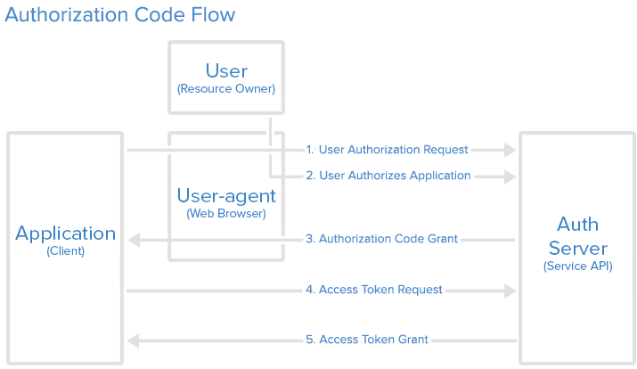
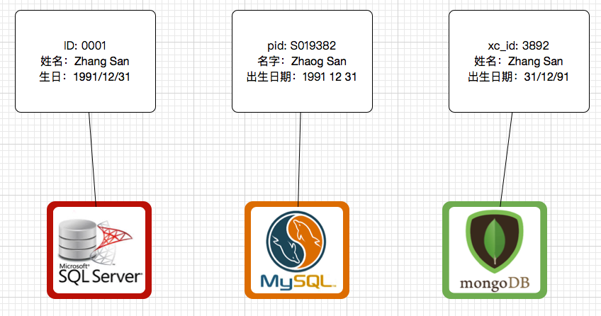
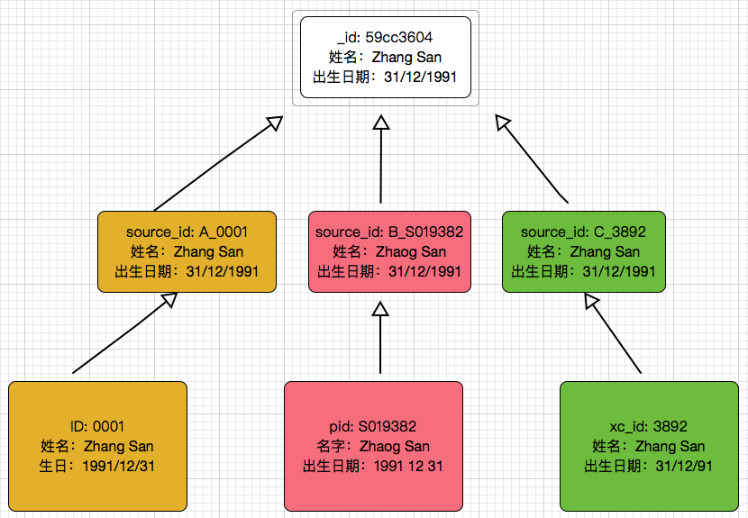

# 如何识别你的用户？

在互联网产品应用的今天，`用户`也许是我们面临最多、最重要的问题，毕竟用户就是上帝，这是我从小就灌输的思想。为了吸引用户，我们绞尽脑汁，打出各种广告，在搜索引擎上进行关键字匹配，通过不同的社交软件延伸客户群体。随着应用的不断深入以及用户群体的不断扩大，随之而来的问题就是，如何识别我们的`上帝`。这里的识别指的是我们如何知道通过不同渠道注册进来的用户是同一个人还是多个不同的用户。今天我给大家分享一下我在这方面的经验以及做法。

# 多渠道用户的问题

这里的多渠道用户一般包括两个常见场景，其一是互联网产品的第三方登录、再一个就是企业的多系统集成。接下来我们分别分析一下面对这两种场景的共同问题。

## 第三方登陆

当一款互联网产品投放市场时，注册流程被看作是是否能吸引用户关注我们的产品的门槛。早先的注册流程，不论是网站还是手机App，都需要繁琐的信息录入，比如用户名、密码、性别、手机号码、电子邮箱等等。注册完成以后，还需要进行邮箱激活认证。如此繁琐的过程往往使人望而却步，很多人就是在注册的过程中放弃了对产品的关注。现如今，随着第三方登录注册的盛行，开发者实现了通过第三方平台进行用户注册的流程，这个过程常常被称之为OAuth2，如下图描述的过程。简单来说就是通过第三方应用程序的接口，调用认证服务器对用户进行身份验证，验证通过后将用户带入到我们的系统中，使之成为我们的注册用户。



这样的流程需要更复杂的开发任务，但是随之而来的好处是显而易见的。用户只需要点击一下确认按钮，基本上就完成了注册的流程。下次用户登录时也不需要在此输入用户名密码，直接把认证的任务交给第三方平台来处理。相比传统的注册方式更加方便快捷。在国内市场中，常见的第三方登录无非是微信、QQ、微博等。如果你的用户来自以上提到的多种渠道，如何识别出哪些用户是同一个人。

## 多系统集成

在企业级系统应用中，存在很多系统集成问题。在企业被重新整合或者IT重构的过程中，常常需要处理如何把多个系统整合在一起。对于每一个系统，他或多或少都会存储一定量的用户数，当多个不同的系统整合在一起时，我们如何判断用户的个数以及如何解决相同用户出现在多个系统中的情况。最常见的问题就是如何判断`张三`在`系统A`中和`系统B中`的`李四`是同一个人。

在以上两种情况下，我们并没有统一的标准来识别我们的用户。更麻烦的是，当用户在原先的系统中录入信息时，有些可能会出现错误输入，姓名，年龄、出生年月、身份ID、手机号等不一定都是绝对正确的。那么我们应当如何做才能识别出我们的用户呢？这里我给大家分享一下我在项目中用到的方法。

# 用户识别

我们先把问题抽象成下图中的例子。



上图中列出了三个系统，分别使用SQL Server，MySQL以及MongoDB作为产品数据库。每个系统中存在一个用户，比较特别的是这个用户看起来都一样，只不过在MySQL中，用户的名字是`Zhaog San`，而其他两个系统都是`Zhang San`；另外，用户出生日期的格式在三个系统中也是不一样的，分别是`1991/12/31`、`1991 12 31`和`31/12／91`。在仔细观察一下会发现，数据库的字段也不用，有`生日`，`出生日期`，`姓名`，`名字`，`ID`和`pid`等。通过人为观察，我们可以人为这三条记录实际上属于同一个人，姓名的不同可能是拼写错误导致，其他问题都可以归结为数据库格式或者字段命名上的差别。如何进行用户识别呢？假定我们要把数据整合进MongoDB中，我给大家分几步来完成。



在上图中，我们对现有三个系统中的用户进行了两步操作，首先我们将用户的字段和格式改成统一标准，字段包括`source_id`,`姓名`,`出生日期`，在source_id中标记了用户来自A、B、C三个系统。之后，再按照一定算法对统一的用户进行合并从而得到图中最上面的纪录。在合并好数据以后，出于纪录可追溯性方面的考虑，我们还需要记录用户是从哪个系统导入进来的。例如下面的json数据：

```json
{
  "_id": 
}

```


