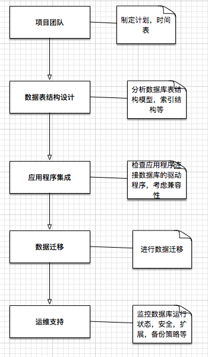

# 教你如何将关系型数据导入MongoDB

关系型数据库已经统治数据存储长达三十几年的时间，即便在2000年以后诞生了NoSQL数据库，但他的出现并没有改变关系型数据的统治地位。随着最近几年互联网应用的快速崛起，以及互联网用户的不断增加，数据来源越来越复杂多样，传统关系型数据存储面临了很大的挑战。这种挑战体现在数据格式死板，改动困难，存储不够灵活，难于扩展等方面。因此，很多企业、公司都先后把数据从关系型迁移到NoSQL上来，其中MongoDB又是使用相对较广泛的数据库实现。本文就为大家分享一下关系型数据导入进MongoDB中应当遵循的步骤和注意的问题。

# 准备工作

在考虑将关系型数据导入到NoSQL中时，首先需要确认的几点是：首先这个导入过程不会是全自动的，并不是像备份数据，迁移数据，记住几个命令那么简单；其次，这个过程不是一个纯技术问题，在制定具体方案时，项目经理，业务分析人员，开发人员，数据库管理员都应当参与到方案的讨论中。迁移的计划、技术方案、各个项目负责人的职责应当在全体人员在场的情况下制定清楚；最后，应当考虑到迁移失败以后的恢复方案，根据应用数据的复杂程度不同，迁移的工作量也不会完全一样。



上图列出了一个项目经过关系型数据向NoSQL中迁移的大致步骤，当然这绝对不是一个唯一的标准。只是通常情况下的做法，可能会根据不同项目的特别需求有一些调整。下面我们来详细分析每一个阶段的具体工作内容。

# 数据表结构定义

有可能你会觉得奇怪，MongoDB不是结构无关的NoSQL数据库吗？为什么我们要提到数据库表结构定义。实际上，NoSQL中的结构无关值得是从技术层面来讲，数据库对表结构没有强约束，任何格式的JSON都可以插入进MongoDB表中。但是，我们在做项目时不能为所欲为的在数据库中插入数据，一定要遵循我们自己定义的一套规则来进行，否则程序根本无法管理数据层面的业务逻辑。在讨论表结构之前，先来看一下MongoDB中的一些术语和关系型数据库的对应关系。

RDBMS | MongoDB
----- | -------
数据库 | 数据库
表(Table) | 集合（Collection）
行（Row）| 文档 （Document）
索引（Index）|索引（Index）
|

看起来很好理解，在MongoDB中我们把表称做`Collection`，表中每一行的数据称作`Document`。其他的基本沿用关系型数据库的命名。在MongoDB中，所有的数据格式都是以JSON为数据库类型，它能够比较灵活的存储各种数据库关系。这也是为什么MongoDB能够在一个Collection中存储各种不同结构的数据。比如，你可以插入这样一个JSON到MongoDB中：`{"user": {"name": "Zhang San", }}`，另外再插入这个JSON`{"product": {"id": "00001"}}`。可以看到这两个JSON没有任何关系，也没有任何相同的属性，但在MongoDB中都是合法的数据，他们可以同时存在于一个Collection中。当然，我们并不鼓励大家这样做，因为这样很难维护你的数据库表格，而且对于查询索引来说也很麻烦，会产生很多不必要的索引存储。我们所说的结构灵活指的是在一个结构框架基础上，可以灵活扩充、添加新的数据而不用重新定义数据Schema。因此，我们在进行数据库迁移之前需要讨论如何定义Collection的结构。

MongoDB将JSON存储成一个叫`BSON`的数据结构中，`BSON`指的是`Binary JSON`，二进制JSON，并在JSON的基础上添加了一些新的数据类型，int，float，long。JSON格式可以灵活的存储嵌入式数据结构，以及数据结构，要是在关系型数据库中实现其难度是很难想象的。在定义Collection结构时，需要根据应用程序实际需求找出数据模型的定义，最大程度的利用MongDB的存储灵活性。例如，下面是一个典型的两张一对多的数据库表格。

学生表：

student_id | name | grade 
-------|----|----
00001 | Zhang San | 3
00002 | Li Si | 2
00003 | Wang Wu | 1
|

成绩表：

student_id | course_id | score
----- | ----- | -----
00001 | FIT00337 | 93
00001 | FIT00338 | 77
00001 | FIT00339 | 57
00001 | FIT00340 | 68
00002 | FIT00338 | 86
00002 | FIT00338 | 73
00003 | FIT00338 | 60
|

其中，第一张表是学生表，第二张是学生成绩表，一个学生可以有多门课程的成绩，因此他们之间是一对多的关系，其中`studnet_id`在学生表中是主键，对应成绩表中的外键。在关系型数据库中这种表示方法完美并正确，但是到了MongoDB中也许就是另外一种存储样式了。为了充分利用JSON格式的内嵌式存储，我们通常会把这种关系存储到Collection中的一条记录（Document），如下所示：

```json
{
  "student_id": "00001",
  "name": "Zhang San",
  "grade": 3,
  "courses": [
    {
      "course_id": "FIT00337",
      "score": 93
    },
    {
      "course_id": "FIT00338",
      "score": 77
    },
    {
      "course_id": "FIT00339",
      "score": 57
    }
  ]
}
...
```

上面是对学生Zhang Scan的记录存储，可以看出我们把学生成绩当作是学生表的内嵌字段，由于是一对多的关系，我们把他存储成一个数组的形式。这种基于JSON文档的存储结构有一下几点优势：

- 数据一目了然，当你从数据库中取出一条学生记录后，关于学生的基本信息全部显示出来。方便大家阅读浏览。
- 避免了多次数据库表连接操作。在关系型数据库中存在着多种表之间的链接操作，比如左右连接，内连，外连等等。为了找到关于一个学生的全部信息，我们也许需要进行若干张表的连接才能拿到想要的数据。除了需要写更复杂的SQL语句以外，数据库的性能也会收到影响。当数据库进行一次连接操作时，内部可能是需要从磁盘不同位置读取数据，加大了IO操作。反观MongoDB，一次查询只需要读取一次磁盘，大大提高的查询效率。
- 删除、修改操作简单方便。如果所有相关学生的信息都存储在一张Collection中，那么对学生信息的删除和修改只需要在一张表中操作就可以。试想一下在关系型数据库中，如果需要删除一个学生纪录，有可能需要操作学生表、成绩表、宿舍表、等等与学生关联的所有表，这样的设计是困扰关系型数据库开发人员的一大难题。搞不好数据库中就会存储大量过时、失效的数据，而这些数据可能成为永远也不会被访问的死角。
- 所有Document都是自我描述的，这方便大家进行数据库的水平扩展。在MongoDB Shard中，我们可以将一个Collection切分到不同的Shard集群中，这种切分方法在不需要进行JOIN的操作前提下变得十分简单。因为，DBA再不用担心需要进行夸节点的JOIN操作。（关于MongoDB水平扩展的内容，情参考另外一篇文章`MongoDB的水平扩展，你做对了吗？`。

# 内嵌还是引用

# 参考文献

https://resources.mongodb.com/migrating-to-mongodb/rdbmstomongodbmigration