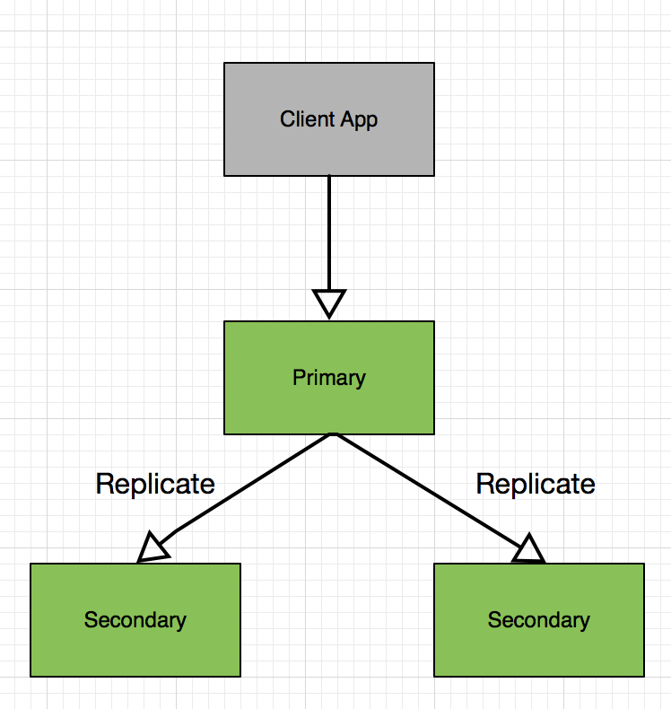
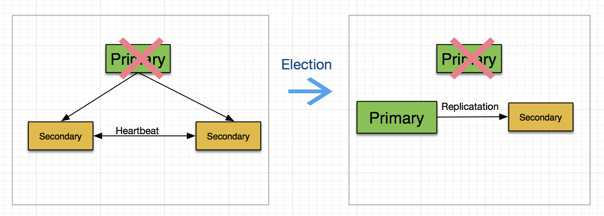
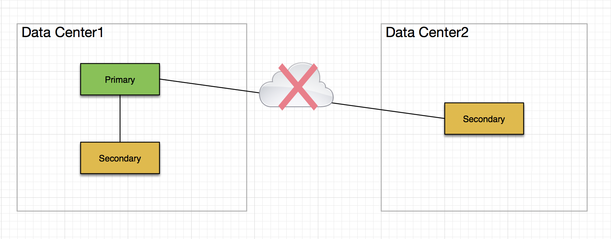
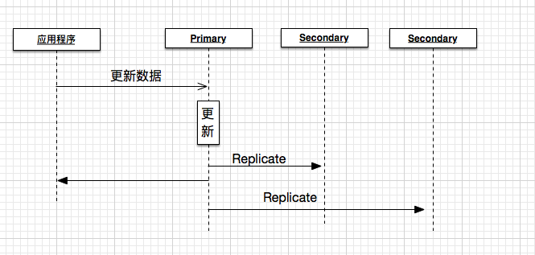

# 多数据中心环境下的MongoDB部署

现如今的互联网应用，我觉得应当称之为数据应用。在为用户提供服务之后，首先要考虑的就是如何利用用户数据来设计下一阶段的产品。为了获得数据，各大IT主管，技术总监，CTO可谓是较劲脑汁，哪怕是一丁点儿的数据，只要用户数量足够庞大，都能产生有价值的业务信息。当你的数据面越来越广，用户数量越来越多的时候，存储这些数据就成了产品发展的瓶颈。于是，各种大数据存储，私有云、公有云存储不断涌现。有的企业为了存储大数据不惜重金搭建自己的数据服务中心。与传统关系型数据库相比，NoSQL在这方面具有得天独厚的优势，没有数据库表的约束，没有严格的结构定义，备份恢复灵活，数据迁移方便，在NoSQL里MongoDB又是一款普遍采用的数据库类型。本文将讨论在多数据中心环境下，如何发挥MongoDB的存储特长。

## 数据库高可用

众所周知，企业各种信息化管理都采用数据库来作为存储方案，企业对这些数据访问的连续性要求越来越高，尤其是最近几年国内企业的快速发展，不少企业的业务范围已经发展到了海外市场，我们除了为中国企业骄傲之外，应当考虑更多的是如何满足并支持这种发展趋势。作为IT从业人员，我们的出发点更多的是从技术角度开始，在技术上保持领先地位才是保证企业业务不受局限的必要条件之一。为了避免因为数据的中断导致各种损失，数据库高可用构架已经成为企业信息化建设中的重中之重。

那么什么是数据库的高可用？我们先从业务场景分析一下。我们以银行业为例，假如你去一家银行存钱，银行柜台工作人员会把数据录入进银行数据库，等你下次查询或者取款时可以看到这比存款纪录。好了，目前为止没有什么意外发生。但是，对于任何一家银行来说，他们不可能只有一个营业窗口，也不可能只有一台ATM取款机。银行的营业网点遍布在全国各个城市、大街小巷。你在一台机器上进行的操作可以在其他任何一个城市、网店查询到。任何一台服务器或者数据库都不可能保证常年正常运行，每台机器都会有一定时间的宕机，而这个时间通常是在允许的范围之内。当数据库宕机时，我们如何保证数据的正常录入和读取呢？

一种常见的解决方法就是主从备份（Master-Slave），每个数据中心都会有多台数据库服务器，其中一台是主数据库，另外的都是从数据库。没台数据库都存储了全部数据的拷贝。每一次数据库的修改操作都先发送到主服务器上，然后由主服务器广播给所有从服务器，从而从服务器也就进行了相应的数据更新。你的应用程序是需要知道主数据库的地址，主数据库和从数据库之间的操作都是在服务器内部来进行的。如果你有一台主数据库，三台从数据库，实际上你就拥有了全部数据的四份拷贝，任何一台数据库宕机或者数据丢失都可以通过其他数据库恢复回来。这就是所谓的数据库高可用的简单构架。下面我们来看一下MongoDB中的高可用是如何设计的。

当所有数据库服务器都存储在一个数据中心时，我们可能会担心如果改数据中心整个瘫痪怎么办，瘫痪有可能是由供电系统导致，也有可能是人为破坏，还有可能是收到战争攻击。不论是什么原因，我们不想把所有赌注都压到一个数据中心上。此时，就有了多个数据中心部署的解决方案。那么，当一套数据库集群部署到多个数据中心时，我们如何保证数据的同步，或者说如何处理当一台服务器宕机导致的服务不可用呢？

## Replica Set

在MongoDB世界中，高可用是通过Replica来实现的，Replica这个单词的字面意思是“复制品”，所以说在Replica Set中每一台数据库都存储了一份全部数据的拷贝，所有数据库的存储内容都是一样的。对外来说整个Replica Set只有一个入口，应用程序服务器只需要通过这一个入口来进行数据库操作。Replica Set内部是由多台角色不同的MongoDB服务器组成，每台服务器相当于是一个`mongod`进程，共分为`Primary`, `Secondary`和`Arbiter`。

- Primary：提供所有数据库的写操作
- Secondary：存储Primary上全部数据库的备份。当Primary不可访问时，Secondary会接替Primary的工作继续对外提供服务
- Arbiter：这是一个比较独特的成员，他并不存储任何数据库，当Primary无法访问时，他只作为推选新Primary的一个投票成员。下面我先给大家简单介绍一下这些概念，然后深入的分析Replica Set中各种场景的原理和注意要点。

### Primary

一般一个Replica Set最少有3个成员负责存储数据，一个Primary，两个Secondary。从MongoDB 3.0以后，一个Replica Set中最多可以有50个成员，但是其中Arbiter只能有7个。下图是一个拥有三个成员的Replica Set，一个Primary，两个Secondary。

Primary负责所有数据库写操作。看到这里有可能你会认为，这样的Replica Set可以自动实现读写分离，Primary负责写操作，Secondary负责读请求，但实际上并不一定是这样，为什么说不一定呢？MongoDB提供了另外一个参数用来设置是否是读写分离，`Read Preference`。默认情况下，Replica中的所有Primary和Secondary都可以处理读请求，只有Primary可以处理写请求。在下面我会给大家详细介绍`Read Preference`的使用场景。当一台Primary不可访问时，一次选举将会在剩下的Replica成员中进行，每个成员有一个投票表决权，得票最多的成员将成为新的Primary，在后面我会详细介绍选举的原理。

### Secondary

Secondary数据库存储了Primary上的所有数据，每当Primary上进行一次数据更新时，都会产生一条oplog纪录，secondary根据Primary上的oplog来同步数据。一台Primary可以连接多台secondary数据库。多台secondary之间通过心跳检测来保持连接。虽然secondary不允许写操作，但是它允许客户端读取纪录，从而实现数据库的读写分离。在primary服务器不可使用的情况下，一台secondary可以成为primary接替数据写操作的任务。除了读写分离之外，secondary还可以被配置成一下几种类型的数据库：
- 由于某些原因，你有可能不希望某一台secondary成为primary服务器，这种情况下你可以配置这台secondary的priorty使它永远不能成为prmary。
- 你也可以禁止用户从secondary读取数据，这样的secondary可以被用在一些独立的场景，例如报表数据库，它会在一个独立的环境运行，不影响应用程序的正常使用。
- 还有一种配置被称为`延时Secondary`，你可以个他配置一个延时时间，在这个时间内他不会同步任何数据，这样的好处是个你一个反悔的时间。例如，你不小心丛Prmary上删除了一些重要数据，在一定时间内，你可以从延时Secondary上把这些数据恢复回来。

### Arbiter

这是一种比较特殊的服务器，他不会存储任何纪录，也不会成为Primary。他的作用是在Replica Set选择Primary时作为一个投票成员。当你的Primary不可以时，Replica中的每个成员都有为新Primary投票的权利，但是如果你的成员个数是偶数，有可能两个候选Primary的得票数一样，此时Arbiter的存在会使投票个数是奇数，这样不会存在得票数一样多的情况。

## MongoDB高可用构架

上面已经提到，MongoDB的高可用是通过Replica Set来完成的，简单来说，当Replica Set中的Primary不可用时，其中一个Secondary将会成为新的Primary。但是这个过程也许并没有你想象的那么简单，这一节中我们来谈谈高可用的内部实现原理。

### Primary选举过程

Replica Set通过公开选举来选出当前某个成员为Primary成员。这个选举过程发生在两个地方，一个地方是当一个Replica Set在初始化的时候进行，另一个场景是当当前的Primary不可用时。下面显示了一个选举过程。

一次选举过程需要一定的时间，在这段时间内Replica不支持写操作，所有成员都将成为只读成员。这里需要介绍一个重要的概念，“大多数”，他的意思很简单就是一半以上成员选出的才算数。换句话说，只有当大多数成员选出来的服务器才能算是新的Primary。上面的例子中，Replica Set一共有三个成员，当一个Primary不可用时，另外两个Secondary构成了Replica Set中的“大多数”，因此他们选出来的服务器可以称为新的Primary。如果在选举过程中没有构成“大多数”选票，则该Replica Set将成为没有Primary成员的Replica，此时其他成员成为Secondary并只提供只读服务。注意上图中右侧新的Replica Set中，以前的primary并没有从Replica中删除，他仍然纪录在Replica里只不过状态被标记为”不可用“。为什么要强调这一点，其实这和刚刚提到的“大多数”成员的概念有关系，通常认为只要是Primary不可用直接将一台Secondary作为Primary就可以了，其实并不是这么简单。如果你盲目的认为一台Primary挂掉就直接从Replica里删除的话，你有可能永远不能理解“大多数”的概念。在这个例子中，如果剩下的两台服务器中的Primary挂掉以后，将不会有新的Primary被选出来，原因是这个Replica Set一共有三个成员，目前只剩下一个Secondary，他并不能构成“大多数“成员，所以选举过程失败，将不会有新的Primary产生。如果此时，前面挂掉的两台Primary中的任何一台恢复工作，他的状态会自动变成可执行，这样就和剩下的那台Secondary组成了新的”大多数“，从而可以成功的再选出一个Primary。

看到这里有的同学可能会问，为什么不设计成只要有一个成员可用就让它成为Primary呢？这样不是可以更好的保证数据库的高可用吗？其实在一开始学习MongoDB的时候我也有类似的问题，答案在下面的多数据中心部署中。

### 多数据中心的高可用

Replica Set为MongoDB高可用提供了基本构架支持，但是当一个Replica中所有成员全部来自一个数据中心时，这种高可用在整个数据中心失效时并不能起到任何修复作用。数据中心的实效可以归结为自然灾害、供电不足、网络故障等原因。所以，将Replica Set成员部署到不同地理位置的数据中心中是灾难恢复的一个常用手段。

我们现回到上一节中提到的问题，为什么说选举一定要通过“大多数”来投票。先看下面的服务器构架：

图中的Replica Set部署在两个数据中心，Data Center1包含一个Primary一个Secondary；Data Center2包含一个Secondary。如果两个数据中心之间的网络出现故障，此时的Replica Set被分割成了两个部分，如果没有“大多数”成员这个概念，那么大家可以想一下会出现什么情况，会有两个Replica Set同时提供服务，Data Center1中的两个成员继续提供数据服务，因为Primary还在继续运行；但是Data Center2中仅剩的一台Secondary会把自己选成Primary并认为另两个成员不可用。当这两个Replica Set接收来自客户端的更新操作后，他们会各自更新个字的数据，那么如果两个数据中心之间的网络恢复以后，谁的数据才是准确的数据，他们之间应当按照什么样的逻辑来同步，可能这个问题并不能完美解决。所以，为了避免这种情况，MongoDB工程师提出了“大多数”的概念，在这个概念下Data Center2中的Secondary由于它不构成“大多数”成员，因此它只能提供只读服务，而Data Center1中的两个成员可以构成“大多数”选票，他们继续承担Replica的职责。

好了，明白了“大多数”的概念以后我们看看在多数据中心情况下如何分配部署MongoDB。还是以上面的例子，我们有一个三个成员Replica Set要部署在两个数据中心上。通常我们把一台Primary和一台Secondary放到一个数据中心，另外一个Secondary放到另一个数据中心。如果其中一个成员是Arbiter，不要把它单独放在一个数据中心，他要和一个有数据的服务器放到一起。此时：
- 如果第一个数据中心失效，这个Replica Set会成为只读服务器；
- 如果第二个数据中心失效，这个Replica Set可以继续正常工作。

如果要把他们部署到三个数据中心上，此时如果任何一个数据中心实效，剩下的两个仍然可以构成一个完整的Replica Set。

### 如何利用Write Concern / Read Preference

在处理MongoDB Reqplica Set时，不得不提的一个关键要素就是Write Concern / Read Preference。由于数据库的全部数据在所有的Replica Set服务器中都有一份拷贝，那么当我们进行一次数据库更新时，是不是需要更新到所有数据库呢？这样做当然理想，因为他可以保证数据的一致性。但是人们对一致性的要求根据不同的需求和应用会有很大区别。有时，我们需要保证集群中的所有数据库都进行了同样的写操作，这样可以保证数据在不同服务器上存储是一致的。但是这样做带来的缺点是此次写操作会花费更多的时间，因为他要通知Replica Set中其他服务器，并且同样的操作也有在其他所有服务器中运行。也有一些对一致性要求不高的场景，此时我们可以在损失一致性的基础上提高数据库性能。那么MongoDB如何控制数据一致性的呢？这就是本节要提及的一个概念：Write Concern / Read Preference。下面我们分别介绍一下他们的在Replica Set中起到的作用。

#### Write Concern

Write Concern定义了MongoDB在进行一次写操作时需要作出的确认级别。在默认情况下，一次数据库写操作只要在Primary服务器上执行完毕后就会返回。如下图所示：

当服务器对Primary发起一次请求时，Primary根据请求更新自身数据，然后返回更新结果，于此同时将本次操作广播到其他Secondary中。所以，应用程序在得到操作完成时并不能保证其他Secondary也做了同样的更新。此时如果另外一个应用程序向其中一台Secondary读取数据，有可能他得到的是更新前的数据。也许你会觉得这种现象的概率很小，设想一下在一个有上千万用户的应用中，每秒都会有若干次数据库读写操作，在这样庞大的负载量环境下，刚刚提到的场景时时刻刻都在发生。Write Concern就是为这种需求而设计的。通过Write Concern我们可以设计一下几个场景，我们可以指定，

- 在一个Replica Set中，只有当一定数量的服务器进行了相应操作才确认此次更新完成。
- 或者，只要Primary获得了更新就算操作完成。
- 或者，大多数服务器进行了操作就确认更新完成。
- 或者，具有某个标签的服务器操作成功就确认。

除了这几个场景之外，我们还可以设置超时时间，当操作在一定时间内没有完成就认为操作失败。

#### Read Preference

于Write Concern类似，Read Preference指的是在对数据库进行读取操作时，Replica Set会将改操作转发给哪个服务器。默认情况下，所有的操作都会有Primary服务器来处理，但是在大应用程序构架中，我们要尽量降低Primary服务器并发访问次数，因此很多人会通过设置Read Preference来分发数据库请求到其他Secondary服务器上，有以下集中模式可供我们选择：

- primary： 默认模式，所有请求都会发送到Primary上。
- primaryPreferred：大部分读请求都会发送到Primary，但是当Primary无法访问时，改请求会被转发到Secondary上。
- secondary： 所有请求都会发送到Secondary上。
- secondaryPreferred： 大部分情况下，读请求被发送到Secondary中，但是如果Replica中没有Secondary，请求会发送到Primary上。
- nearest：  请求会被发送到网络最近的服务器上。该模式在多数据中心上非常有效。

对于secondary和secondaryPreferred两种模式我们需要注意，特别是在多数据中心环境中，用户读到的数据有可能不是最新的。原因在上一节Write Concern中已经提到。在shard环境中，如果允许Balancer，从Secondary中读到的数据有可能有重复。原因是Balancer的运行可能会导致一些Chunk是不完整的，而一些Chunk是重复的。关于Shard的应用，情参考我的另一篇文章`MongoDB的水平扩展，你做对了吗？`。

# 参考文献

[dbKoda](https://www.dbkoda.com)

[MongoDB Docker Cluster](https://github.com/zhaoyi0113/mongo-cluster-docker)

[CAP theorem](https://en.wikipedia.org/wiki/CAP_theorem)

[Read Preference](https://docs.mongodb.com/v3.2/core/read-preference/)

[Write Preference](https://docs.mongodb.com/manual/reference/write-concern/)

# 作者简

赵翼，毕业于北京理工大学，目前就职于SouthbankSoftware，从事NoSQL，MongoDB方面的开发工作。曾在GE，ThoughtWorks，元气兔担任项目开发，技术总监等职位，接触过的项目种类繁多，有Web，Mobile，医疗器械，社交网络，大数据存储等。