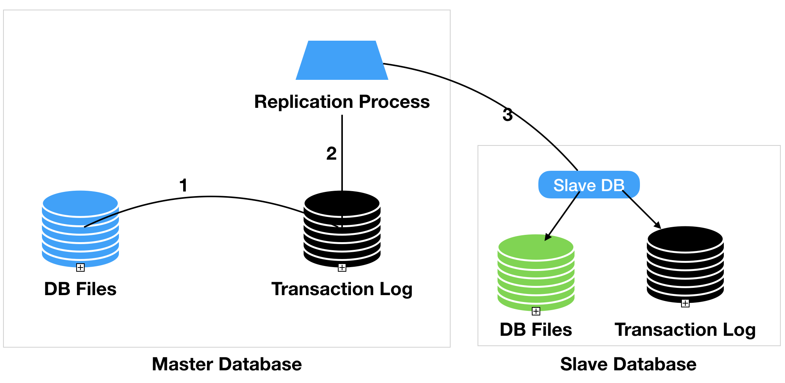
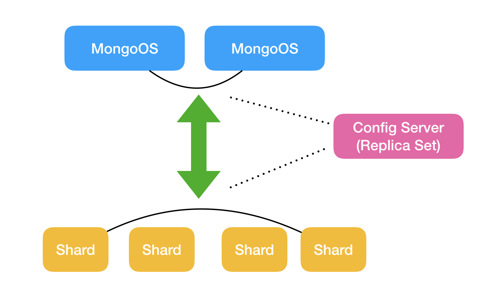
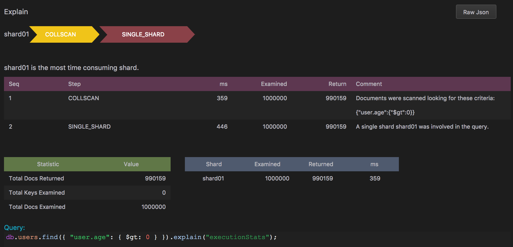
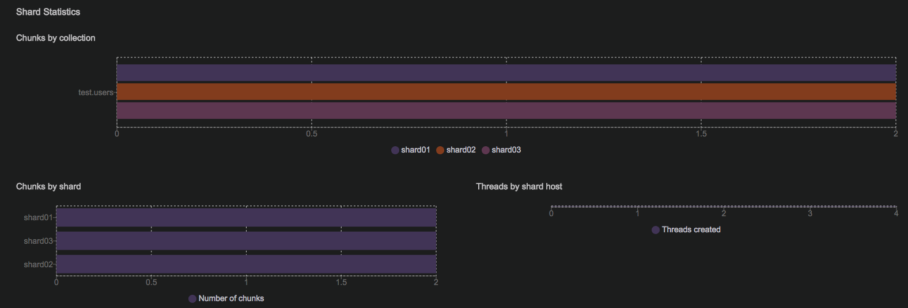
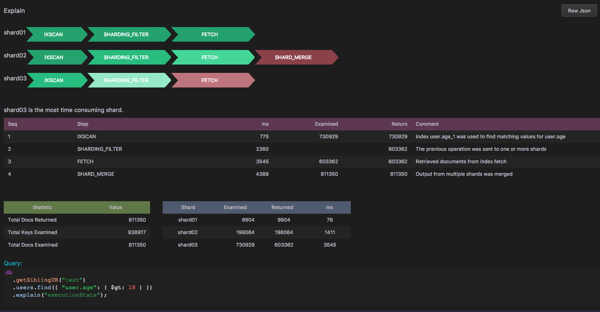
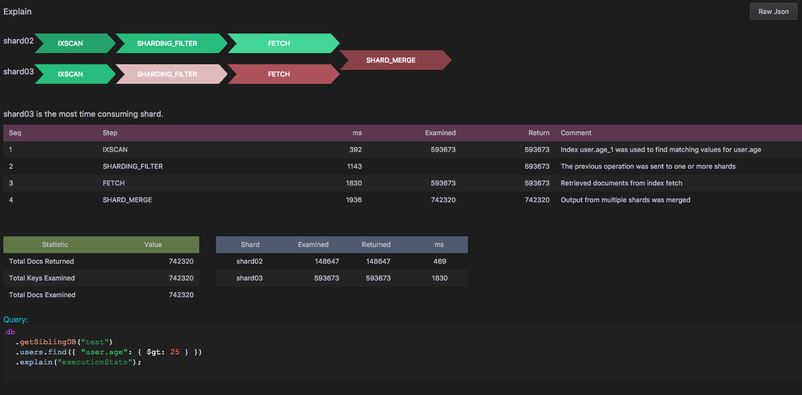

# MongoDB的水平扩展，你做对了吗？

## 分布式数据库的前世今生

当人们一开始使用数据库系统的时候，所有数据都是跑在一台服务器上，即所谓的单机数据库服务器。在企业级应用中，我们会搭建一台应用程序服务器，一般它会被运行在一台服务器或者工作站上，大多数情况下采用Linux／Unix／Windows操作系统，也有人把这样的服务器称之为应用程序服务器。顾名思义，他的作用是处理复杂的业务逻辑。但是一点需要注意的是，在这样的构架中，这台应用程序服务器不会存储任何业务数据，也就是说，他只负责逻辑运算，处理用户请求，真正存放数据的地方是前面提到的那台数据库服务器。应用程序服务器将用户的请求转换成数据库语言（通常是SQL），运行在数据库中，从而进行数据的增删改查。数据库服务器不会对外直接开放，管理人员也不允许直接在数据库层面操作数据。所有的操作都会经过应用程序服务器来完成。应用程序层、数据库层再加上UI层，被称为传统的Web三层构架。

### Replication

随着数据量的增大，技术的不断进步以及需求的增加，安全性、可靠性、容错性、可恢复性等因素被人们考虑进数据库的设计中。于是出现了分布式数据库系统。以前在存储数据的时候，都是采用单体构架模式，及数据全部存储在一台数据库中，一旦数据库出现问题，所有的应用请求都会收到影响。数据库的恢复也是一个令人头疼的问题。有时一次数据库的全回复会运行几个小时甚至几天的时间。在互联网应用不断普及的今天，业务需求对构架产生了严峻的挑战。没有哪个互联网应用会允许若干小时的宕机时间。分布式数据库的产生，为我们提供了技术上的解决方案。在部署数据库的时候，不用于以前的单体应用，分布式下数据库部署包括多点部署，一套业务应用数据库被分布在多台数据库服务器上，分主从服务器。主服务器处理日常业务请求，从服务器在运行时不断的对主服务器进行备份，当主服务器出现宕机、或者运行不稳定的情况时，从服务器会立刻替换成主服务器，继续对外提供服务。此时，开发运维人员会对出现问题的服务器进行抢修、回复，之后再把它投入到生产环境中。这样的构架也被称作为高可用构架，它支持了灾难恢复，为业务世界提供了可靠的支持，也是很多企业级应用采用的主流构架之一。需要指出的是，在这样的主从设计中，从数据库常常被设计成只读，主数据库支持读写操作。一般会有一台主数据库连接若干台从数据库。在互联网产品的应用中，人们大多数情况下会对应用服务器请求读操作，这样应用服务器可以把读操作请求分发到若干个从数据库中，这样就避免了主数据库的并发请求次数过高的问题。至于为什么大多数应用都是读操作，你可以想一下在你使用微信或者微博的时候，你是看别人发布的图片多还是自己发布的时候多。当你不断下滑屏幕，刷新朋友圈，这些都是读请求。只有当评论、点赞、分享的时候才会进行写操作。

我们的世界就是这样，当技术为人们解决了现实问题以后，新的需求会层出不穷。例如，在解放以后，人们面临的问题是吃喝，农民如何能够填饱肚子成为国家急需解决的问题。国家搞大锅饭，搞集体主义，搞计划经济，每人分到的口粮基本相同，没有区别。但是问题出现在农民劳动不积极，没有主动意识。后来，在70年代末，80年代初的时候，政府要求农村实行责任制，土地承包制，这样的政策立竿见影，激发了农民的劳动积极性，没有了大锅饭，谁勤奋，谁的产出就多，谁分到的粮食就充足；因此立刻解决了人们的吃饭问题。吃饭问题解决以后，就是物质文化需求，百姓手里有了钱，有了余粮，不用像以前那样有事没事儿都在地里干活，日出而做日落而息的日子已经远去，自己可以支配的时间越来越充足，接下来就是要享受生活。盖房、打扮、娱乐、教育，各种活动不断涌现出来，再后来就是普及高等教育，城市化，现代化，国际化，家家户户都有大学生，很多家庭甚至都送孩子出国留学。在这样的刺激下，国家GDP一跃成为世界第二，在未来几年中称为世界第一大经济体也是指日可待。智能手机，互联网+，创业潮的不断兴起，点燃了这样一个有几千年文明历史的民族的激情。各种新点子、新概念不断的涌现，谁的手机里没有安装几十个互联网应用，从订餐，快递，到住房，旅游，再到教育，养老，那一个环节没有互联网的支持，没有技术的成分。我们就是生存在这样一个的平凡而又不乏豪情的社会中。许许多多的需求和数据充斥着我们的构架，挑战着我们的数据存储。

对此，你可能已经想到，前面提到的分布式数据库多点部署是不是会存在大量的瓶颈。比如，在主从数据库结构中，从数据库的内容基本上可以说是主数据库的一份全拷贝，这样的技术称之为`Replication`。`Replication`在实现主从数据同步时，通常采用`Transaction Log`的方式，比如，当一条数据插入到主数据库的时候，主数据库会像`Trasaction Log`中插入一条记录来声明这次数据库写纪录的操作。之后，一个`Replication Process`会被触发，这个进程会把`Transaction Log`中的内容同步到从数据库中。整个过程如下图所示：



对于数据库的扩展来说，通常有两种方法，水平扩展和垂直扩展。

- 垂直扩展：这种扩展方式比较传统，是针对一台服务器进行硬件升级，比如添加强大的CPU，内存或者添加磁盘空间等等。这种方式的局限性是仅限于单台服务器的扩容，尽可能的增加单台服务器的硬件配置。

- 水平扩展：这种方式是目前构架上的主流形式，指的是通过增加服务器数量来进行对系统性能的扩容。在这样的构架下，单台服务器的配置并不会很高，可能是配置比较低、很廉价的PC，每台机器承载着系统的一个子集，所有机器服务器组成的集群会比单体服务器提供更强大、高效的系统容载量。这样的问题是系统构架会比单体服务器复杂，搭建、维护都要求更高的技术背景。MongoDB中的Sharding正式为了水平扩展而设计的，下面就来挤开shard面纱，探讨一下shard中不同分片的技术区别以及对数据库系统的影响。

### 分片 （Shard）

这样的结构可以保证从数据库中的全部数据都会有多分拷贝，数据库的高可用可以保障。但是新的问题是如果要存储大量的数据，不论主从服务器，都需要存储全部数据库，这样检索必然会出现性能问题。可以这样讲，`Replication`只能算是分布式数据库的第一阶段。主要解决的是数据库高可用，读数据可以水平扩展，部分解决了主数据并发访问量大的问题。但是它并没有解决数据库写操作的分布式需求，此外在数据库查询时也只限制在一台服务器上，并不能支持一次查询多台数据库服务器。我们假设，如果有一种构架，可以实现数据库水平切分，把切分的数据分布存储在不同的服务器上，这样当查询请求发送到数据库时，可以在多台数据库中异步检索符合查询条件的语句，这样不但可以利用多台服务器的CPU，而且还可以充分利用不同服务器上的IO，显而易见这样的构架会大大提高查询语句的性能。但是这样的实现却给数据库设计者代码不少麻烦，首先要解决的就是事务（`Transaction`），我们知道在进行一次数据库写操作的时候，需要定一个事务操作，这样在操作失败的时候可以回滚到原始状态，那当在分布式数据库的情况下，事务需要跨越多个数据库节点以保持数据的完整性，这给开发者带来不少的麻烦。此外，在关系型数据库中存在大量表关联的情况，分布式的查询操作就会牵扯到大量的数据迁移，显然这必将降低数据库性能。但是，在非关系型数据库中，我们弱化甚至去除了事务和多表关联操作，根据CAP理论：在分布式数据库环境中，为了保持构架的扩展性，在分区容错性不变的前提下，我们必须从一致性和可用性中取其一，那么，从这一点上来理解“NoSQL数据库是为了保证A与P，而牺牲C”的说法，也是可以讲得通的。同时，根据该理论，业界有一种非常流行的认识，那就是：关系型数据库设计选择了一致性与可用性，NoSQL数据库设计则不同。其中，`HBase`选择了一致性与分区可容忍性，`Cassandra`选择了可用性与分区可容忍性。

本文关注于非关系型数据库中分区的技巧和性能，以MongoDB为例进行说明，在下面的章节中就围绕这一点展开讨论。

# MongoDB 分片原理

MongoDB中通过Shard支持服务器水平扩展，通过Replication支持高可用（HA）。这两种技术可以分开来使用，但是在大数据库企业级应用中通常人们会把他们结合在一起使用。

## MongoDB Sharding

首先我们简要概述一下分片在MongoDB中的工作原理。通过分片这个单词我们可以看出，他的意思是将数据库表中的数据按照一定的边界分成若干组，每一组放到一台MongoDB服务器上。那用户数据举例，比如你有一张数据表存放用户基本信息，可能由于你的应用很受欢迎，短时间内就积攒了上亿个用户，这样当你在这张表上进行查询时通常会耗费比较长的时间，这样这个用户表就称为了你的应用程序的性能瓶颈。很显然的做法是对这张用户表进行拆分，假设用户表中有一个`age`年龄字段，我们先做一个简单的拆分操作，按照用户的年龄段把数据放到不同的服务器上，以20为一个单位，20岁以下的用户放到server1，20到40岁的用户放到server2，40-60岁的用户放到server3，60岁以上放到server4，后面我们会讲这样的拆分是否合理。在这个例子中，用户年龄`age`就是我们进行`Sharding`的`Shard Key`，拆分出来的`server1`, `server2`, `server3`和`server4`就是这个集群中的4个`Shard`服务器。好，Shard集群已经有了，并且数据已经拆分完好，当用户进行一次查询请求的时候我们如何向这四个Shard服务器发送请求呢？例如：我的查询条件是用户年龄在18到35岁之间，这样个查询请求应当发送到`server1`和`server2`，因为他们存储了用户年龄在40以下的数据，我们不希望这样的请求发送到另外两台服务器中因为他们并不会返回任何数据结果。此时，另外一个成员就要登场了，`mongos`，它可以被称为Shard集群中的路由器，就像我们网络环境中使用的路由器一样，它的作用就是讲请求转发到对应的目标服务器中，有了它我们刚才那条查询语句就会正确的转发给`server`和`server2`，而不会发送到`server3`和`server4`上。除了`mongos`和`shard`之外，另一个必须的成员是配置服务器，`config server`，它存储Shard集群中所有其他成员的配置信息，`mongos`会到这台`config server`查看集群中其他服务器的地址，这是一台不需要太高性能的服务器，因为它不会用来做复杂的查询计算，值得注意的是，在MongoDB3.4以后，`config server`必须是一个`replica set`。理解了上面的例子以后，一个Shard集群就可以部署成下图所示的结构：



其中：

- shard:  每一个Shard服务器存储数据的一个子集，例如上面的用户表，每一个Shard存储一个年龄段的用户数据。
- mongos: 处理来自应用服务器的请求，它是在应用服务器和Shard集群之间的一个接口。
- config server: 存储shard集群的配置信息，通常部署在一个replica set上。

## MongoDB Shard 性能分析

### 环境准备

这样的服务器构架是否合理，或者说是否能够满足数据量不断增长的需求。如果仅仅是通过理论解释恐怕很难服众，我已经信奉理论结合实际的工作方式，所以在我的文章中处理阐述理论之外，一定会有一定的示例为大家验证理论的结果。接下来我们就根据上面的例子做一套本地运行环境。由于MongoDB的便捷性，我们可以在任何一台PC上搭建这样一个数据库集群环境，并且不限制操作系统类型，任何Windows/Linux/Mac的主流版本都可以运行这样的环境。

对于如何创建一个MongoDB Shard环境，网上有很多教程和命令供大家选择，创建一个有3个Mongos，每个Mongos连接若干个Shards，再加上3个config server cluster，通常需要20几台MongoDB服务器。如果一行命令一行命令的打，即便是在非常熟练的情况下，没有半个小时恐怕搭建不出来。不过幸运的是有第三方库帮我们做这个事情，大家可以查看一下`mtools`。他是用来创建各种MongoDB环境的命令行工具，代码使用`python`写的，可以通过`pip install`安装到你的环境上。具体的使用方法可以参考`https://github.com/rueckstiess/mtools/wiki/mlaunch`。也可以通过`https://github.com/zhaoyi0113/mongo-cluster-docker`上面的脚本把环境搭载Docker上面。

下面的命令用来在本地创建一个MongoDB Shard集群，包含1个`mongos`路由，3个`shard` replica，每个replica有3个`shard`服务器，3个`config`服务器。这样一共创建13个进程。

```
mlaunch init --replicaset --sharded 3 --nodes 3 --config 3 --hostname localhost --port 38017 --mongos 1
```

服务器创建好以后我们可以连接到`mongos`上看一下shard状态，端口是上面制定的38017。

```javascript
mongos> sh.status()
--- Sharding Status --- 
  ...
  shards:
	{  "_id" : "shard01",  "host" : "shard01/localhost:38018,localhost:38019,localhost:38020",  "state" : 1 }
	{  "_id" : "shard02",  "host" : "shard02/localhost:38021,localhost:38022,localhost:38023",  "state" : 1 }
	{  "_id" : "shard03",  "host" : "shard03/localhost:38024,localhost:38025,localhost:38026",  "state" : 1 }
  active mongoses:
	"3.4.0" : 1
  ...
  ```

可以看到刚才创建的shard服务器已经加入到这台mongos中了，这里有3个shard cluster，每个cluster包含3个shard服务器。除此之外，我们并没有看到关于Shard更多的信息。这是因为这台服务器集群还没有任何数据，而且也没有进行数据切分。

### 数据准备

首先是数据的录入，为了分析我们服务器集群的性能，需要准备大量的用户数据，幸运的是`mtools`提供了`mgenerate`方法供我们使用。他可以根据一个数据模版向MongoDB中插入任意条json数据。下面的json结构是我们在例子中需要使用的数据模版：

```json
{
    "user": {
        "name": {
            "first": {"$choose": ["Liam", "Aubrey", "Zoey", "Aria", "Ellie", "Natalie", "Zoe", "Audrey", "Elizabeth", "Scarlett", "Layla", "Victoria", "Brooklyn", "Lucy", "Lillian", "Claire", "Nora", "Riley", "Leah"] },
            "last": {"$choose": ["Smith", "Patel", "Young", "Allen", "Mitchell", "James", "Anderson", "Phillips", "Lee", "Bell", "Parker", "Davis"] }
        }, 
        "gender": {"$choose": ["female", "male"]},
        "age": "$number", 
        "address": {
            "zip_code": {"$number": [10000, 99999]},
            "city": {"$choose": ["Beijing", "ShangHai", "GuangZhou", "ShenZhen"]}
        },
        "created_at": {"$date": ["2010-01-01", "2014-07-24"] }
    }
}
```

把它保存为一个叫`user.json`的文件中，然后使用`mgenerate`插入十万条随机数据。随机数据的格式就按照上面`json`文件的定义。你可以通过调整 `--num`的参数来插入不同数量的Document。([Link to mgenerate wiki](https://github.com/rueckstiess/mtools/wiki/mgenerate))

`mgenerate user.json --num 1000000 --database test --collection users --port 38017`

上面的命令会像`test`数据库中`users` collection插入一百万条数据。在有些机器上，运行上面的语句可能需要等待一段时间，因为生成一百万条数据是一个比较耗时的操作，之所以生成如此多的数据是方便后面我们分析性能时，可以看到性能的显著差别。当然你也可以只生成十万条数据来进行测试，只要能够在你的机器上看到不同`find`语句的执行时间差异就可以。

插入完数据之后，我们想看一下刚刚插入的数据在服务器集群中是如何分配的。通常，可以通过`sh.status()` MongoDB shell命令查看。不过对于一套全新的集群服务器，再没有shard任何collection之前，我们是看不到太多有用的信息。不过，可以通过explain一条查询语句来看一下数据的分布情况。这里不得不强调一下在进行数据性能分析时一个好的IDE对工作效率有多大的影响，我选择[dbKoda](www.dbkoda.com)作为MongoDB的IDE主要原因是他是目前唯一一款对MongoDB Shell的完美演绎，对于MongoDB Shell命令不太熟悉的开发人员来说尤为重要，幸运的是这款IDE还支持Windows/Mac/Linux三种平台，基本上覆盖了绝大多数操作系统版本。下面是对刚才建立的一百万条collection的一次find的explain结果。（对于Explain的应用，大家可以参考我的另外一片文章：[如何通过MongoDB自带的Explain功能提高检索性能？](https://mp.weixin.qq.com/s/xQniuEaUI9g3ICHsI66NRw))



从上图中可以看到，我们插入的一百万条数据全部被分配到了第一个shard服务器中，这并不是我们想看到的结果，不要着急，因为我还没有进行数据切分，所以MongoDB并不会自动的分配这些数据。下面我们来一点一点分析如何利用Shard实现高效的数据查询。

### 配置Shard数据库

环境搭建好并且数据已经准备完毕以后，接下来的事情就是配置数据库并切分数据。方便起见，我们把用户分为三组，20岁以下（junior)，20到40岁（middle）和40岁以上（senior），为了节省篇幅，我在这里不过多的介绍如何使用MongoDB命令，按照下面的几条命令执行以后，我们的数据会按照用户年龄段拆分成若干个chunk，并分发到不同的shard cluster中。如果对下面的命令不熟悉，可以查看MongoDB官方文档关于Shard Zone/Chunk的解释。

```javascript
db.getSiblingDB('test').getCollection('users').createIndex({'user.age':1})
sh.setBalancerState(false)

sh.addShardTag('shard01', 'junior')
sh.addShardTag('shard02', 'middle')
sh.addShardTag('shard03', 'senior')

sh.addTagRange('test.users', {'user\uff0eage': MinKey}, {'user\uff0eage':20}, 'junior')
sh.addTagRange('test.users', {'user\uff0eage': 21}, {'user\uff0eage':40}, 'middle')
sh.addTagRange('test.users', {'user\uff0eage': 41}, {'user\uff0eage': MaxKey}, 'senior')

sh.enableSharding('test')
sh.shardCollection('test.users', {'user.age':1})
sh.setBalancerState(true)
```

从上面的命令中可以看出，我们首先要为Shard Key创建索引，之后禁止Balancer的运行，这么做的原因是不希望在Shard Collection的过程中还运行Balancer。之后将数据按照年龄分成三组，分别标记为`junior`, `middle`，`senior`并把这三组分别分配到三个Shard集群中。 之后对test库中的users collection进行按用户年龄字段的shard操作，如果Shard collection成功返回，你会得到下面的输出结果：`{ "collectionsharded" : "test.users", "ok" : 1 }`。

**关于Shard需要注意的几点**

- 一旦你对一个Colleciton进行了Shard操作，你选择的Shard Key和它对应的值将成为不可变对象，所以：
  
  - 你无法在为这个collection重新选择Shard Key
  - 你不能更新Shard key的值

随后不要忘记，我们还需要将Balancer打开：`sh.setBalancerState(true) `。刚打开以后运行`sh.isBalancerRunning()`应当返回`true`，说明Balancer正在运行调整Chunk在不同Shards服务器。一般Balancer会运行一段时间，因为他要对分组的数据重新分配到指定的shard服务器上，你可以通过`sh.isBalancerRunning()`命令查看Balancer是否正在运行。现在可以稍事休息一下喝杯咖啡或看看窗外的风景。

为了理解数据如何分布在3个shard集群中，我们有必要分析一下chunk和zone的划分，下图是在dbKoda上显示Shard Cluster统计数据，可以看到数据总共被分成6个chunks，每个shard集群存储2个chunk。



对此有些同学会有疑问，为什么我们的数据会被分为6个chunks，而且每个shard集群个分配了2个chunk。是谁来保证数据的均匀分配？下面我就给大家解释一下他们的概念以及我们应当如何使用。

### Chunk

我们已经知道MongoDB是通过shard key来对数据进行切分，被切分出来的数据被分配到若干个chunks中。一个chunk可以被认为是一台shard服务器中数据的子集，根据shard key，每个chunk都有上下边界，在我们的例子中，边界值就是用户年龄。chunk有自己的大小，数据不断插入到mongos的过程中，chunk的大小会发生变化，chunk的默认大小是64M。当然MongoDB允许你对chunk的大小进行设置，你也可以把一个chunk切分成若干个小chunk，或者合并多个chunk。一般我不建议大家手动操作chunk的大小，或者在mongos层面切分或合并chunk，除非真有合适的原因才去这么做。原因是，在数据不断插入到我们的集群中时，mongodb中的chunk大小会发生很大的变化，当一个chunk的大小超过了最大值，mongo会根据shard key对chunk进行切分，在必要的时候，一个chunk可能会被切分成多个小chunk，大多数情况下这种自动行为已经满足了我们日常的业务需求，无需进行手动操作，另一点原因是当进行chunk切分后，直接的结果会导致数据分配的不均匀，此时balancer会被调用来进行数据重新分配，很多时候这个操作会运行很长时间，无形中导致了内部结构的负载平衡，因此不建议大家手动拆分。当然，理解chunk的分配原理还是有助于大家分析数据库性能的必要条件。我在这里不过多的将如何进行这些操作，有兴趣的读者可以参考MongoDB官方文档，上面有比较全面的解释。这里我只强调在进行chunk操作的时候，要注意一下几个方面，这些都是影响你MongoDB性能的关键因素。

- 如果存在大量体积很小的chunk，他可以保证你的数据均匀的分布在shard集群中但是可能会导致频繁的数据迁移。这将加重mongos层面上的操作。
- 大的chunk会减少数据迁移，减轻网络负担，降低在mongos路由层面上的负载，但弊端是有可能导致数据在shard集群中分布的不均匀。
- Balancer会在数据分配不均匀的时候自动运行，那么Balancer是如何决定什么情况下需要进行数据迁移呢？答案是Migration Thresholds，当chunk的数量在不同shard replica之间超过一个定值时，balancer会自动运行，这个定值根据你的shard数量不同而不同。

### Zones

可以说chunk是MongoDB在多个shard集群中迁移数据的最小单元，有时候数据的分配不应按照我们意向的方向进行，就拿上面的例子来说，虽然我们选择了用户年龄作为shard key，但是MongoDB并不会按照我们设想的那样来分配数据，如何进行数据分配就是通过Zones来实现。Zones解决了shard集群于shard key之间的关系，我们可以按照shard key对数据进行分组，每一组称之为一个Zone，之后把Zone在分配给不同的Shard服务器。一个Shard可以存储一个或多个Zone，前提是Zone之间没有数据冲突。Balancer在运行的时候会把在Zone里的chunk迁移到关联这个Zone的shard上。

理解了这些概念以后，我们对数据的分配就有了更清楚的认识。我们对前面提到的问题就有了充分的解释。表面上看，数据的分布貌似均匀，我们执行几个查询语句看看性能怎样。这里再次用到dbKoda中的explain视图。



上图中查找年龄在18周岁以上的用户，根据我们的分组定义，三个shard上都有对应的纪录，但是shard1对应的年龄组是20岁以下，应该包括数量较少的数据，所以在图中shard里表里现实的shard01返回了9904条记录，远远少于其他两个shard，这也符合我们的数据定义。在上面性能途中也可以看出，这条语句在shard01上面运行的时间也是相对较少的。

再看看下面的例子，如果我们查找25周岁以上的用户，得到的结果中并没有出现shard1的身影，这也是符合我们的数据分配，因为shard1只存储了年龄小于20周岁的用户。



### 你选择的Shard Key合适吗？

了解了数据是如何分布的以后，咱们在回过头来看看我们选择的shard key是否合理。细心的读者已经发现，上面运行的explain结果中存在一个问题，就是shard3存储了大量的数据，如果我们看一下每个年龄组的纪录个数，会发现shard1、shard2、shard3分别包括198554, 187975, 593673，显然年龄大于40岁的用户占了大多数。这并不是我们希望的结果，因为shard3成为了集群中的一个瓶颈，数据库操作语句在shard3上运行的速度会大大超过另外两个shard，这点从上面的explain结果中也可以看到，查询语句在shard3上的运行时间是另外两个shard的两倍以上。更重要的是，随着用户数量的不断增加，数据的分布也会出现显著变化，在系统运行一段时间以后，可能shard2的用户数超过shard3，也有可能shard1称为存储数据量最多的服务器。这种数据不平衡是我们不希望看到的。原因在哪里呢？是不是觉得我们选择的用户年龄作为分组条件是一个不太理想的key。那么什么样的key能够保证数据的均匀分布呢？接下来我们分析一下shard key的种类。

### Ranged Shard Key

我们上面选择的年龄分组就是用的这种shard key。根据shard key的取值，它把数据切分成连续的几个区间。取值相近的纪录会放进同一个shard服务器。好处是查询连续取值纪录时，查询效率可以得到保证。当数据库查询语句发送到mongos中时，mongos会很快的找到目标shard，而且不需要将语句发送到所有的shard上，一般只需要少量的shard就可以完成查询操作。缺点是不能保证数据的平均分配，在数据插入和修改时会产生比较严重的性能瓶颈。

### Hashed Shard Key

于Ranged Shard Key对应的一种被称之为Hashed Shard Key，它采用字段的索引哈希值作为shard key的取值，这样做可以保证数据的均匀分布。在mongos和各个shard集群之间存在一个哈希值计算方法，所有的数据在迁移时都是根据这个方法来计算数据应当被迁移到什么地方。当mongos接收到一条语句时，通常他会把这条语句广播发布到所有的shard上去执行。

有了上面的认识，我们如何在Ranged和Shard之间进行选择呢？下面两个属性是我们选择shard key的关键。

### Shard Key Cardinality （集）

`Cardinality`指的是shard key可以取到的不同值的个数。他会影响到Balancer的运行，这个值也可以被看做是Balancer可以创建的最大chunk个数。以我们年龄字段为例，加入一个人的年龄在100岁以下，那么这个字段的cardinality可以取100个不同的值。对于一个唯一的年龄数据，不会出现在不同的chunk中。如果你选择的Shard Key的cardinality很小，比如只有4个，那么数据会被分发到4个不同的shard中，这样的结构也不适合服务器的水平扩展，因为不会有数据被分割到第五个shard服务器上。

### Shard Key Frequency（频率）

`Frequency`指的是shard key的重复度，也就是对于一个字段，有多少取值相同的纪录。如果大部分数据的shard key取值相同，那么存储他们的chunk会成为数据库的一个瓶颈。而且，这些chunk也变成了不可在切分的chunk，严重影响了数据库的水平扩展。所以，尽量选择低频率的字段作为shard key。

### Shard Key Increasing Monotonically 单调增长

单调增长在这里的意思是在数据被切分以后，新增加的数据会按照其shard key取值向shard中插入，如果新增的数据的key值都是向最大值方向增加，那么这些新的数据会被插入到一个shard服务器上。例如我们前面的用户年龄分组字段，如果系统的新增用户都是年龄大于40岁的，那么shard3将会存储所有的新增用户，shard3会成为系统的性能瓶颈。在这种情况下，应当考虑使用Hashed Shard Key。

# 小结

在shard key的选择方面没有一个统一的方法，要根据具体的需求和数据增长的方向来设计。在我们日常的开发过程中，并不是所有技术问题都应当由技术人员来解决，这个世界是一个业务驱动的时代，而技术主要是为业务服务，我们要提高对需求变化的相应速度。像本文中如何选择Shard Key的问题，我觉得并不能单纯的通过技术来考量，更多的是要和业务人员讨论各个数据字段的意义，使用的业务价值以及未来业务的增长点。如果在一开始shard key的选择出现错误，那么在接下来的应用过程中想要改变shard key是一件极其繁琐的过程。可能你需要备份你的collection，然后重新创建shard服务并恢复数据，这个过程很可能需要运行很长一段时间。在互联网应用的今天，服务器的宕机事件都是以秒为单位计算，很可能错误的shard key选择会给你的应用带来灾难性的后果。希望此文能给各位一点启示，在项目初期的设计阶段充分考虑到各方面的因素。

# References
[MongoDB Shard](https://docs.mongodb.com/manual/sharding/)

[Shard Keys](https://docs.mongodb.com/manual/core/sharding-shard-key/)

[MongoDB Docker Cluster](https://github.com/zhaoyi0113/mongo-cluster-docker)

[CAP theorem](https://en.wikipedia.org/wiki/CAP_theorem)