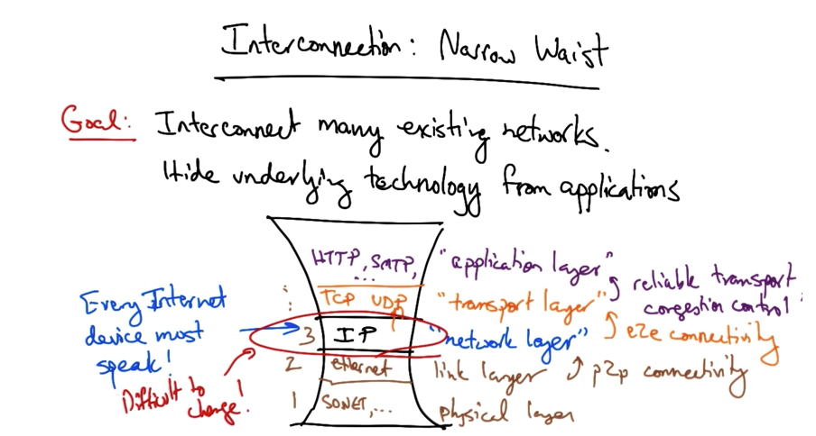
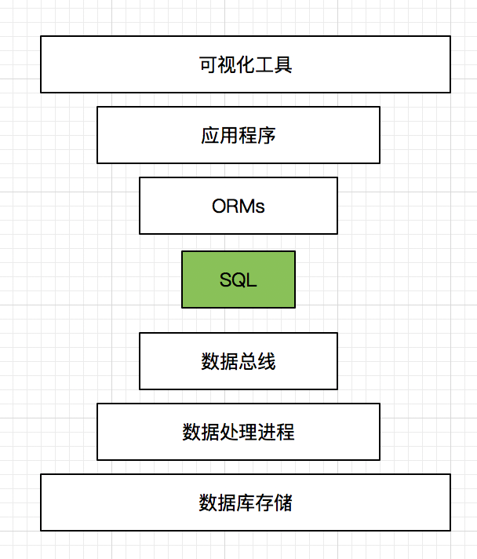

# SQL：王者归来

"SQL已经过时了“，”传统关系型数据库已经无法满足业务需求“，”NoSQL，大数据是新时代的产物“。我们已经听到太多关于这方面的话题，不光是在数据库范围内，在数据库之外的领域大家仍然探讨这这样的话题。但是，这么说真的正确吗？在我看来，SQL不但没有过时，他的光芒才刚刚开始。在这篇文章中，我们来探讨一下SQL语句在现如今的开发过程中承担着一种怎么样的角色。

## SQL诞生

SQL最早可以追溯到1970 IBM研究中心，这里正是关系型数据库诞生的地方。那个时候，数据查询是一件非常烦碎的工作，需要大量的计算，中间结果，各种数学公式和定义交织在一起。Donald Chamberlin 和 Raymond Boyce两位博士发现了数据查询的瓶颈，开始对查询语句做全新的定义。他们的出发点是要让没有数学基础的人也可以通过查询语句来从数据库中检索数据。在当时那个年代，C语言还算是高级语言的领军人物，当时SQL的设计者认为，他们要设计一种类似人类语言的数据库查询语句，经过几年努力，在1974年SQL终于诞生了，之后的几十年里SQL很快发展成为数据库语言的标准，几乎所有的关系型数据库， System R, Ingres, DB2, Oracle, SQL Server, PostgreSQL, MySQL都实现了对SQL的支持。

SQL确实很好用，也收到大家的喜爱，但是事情在1989年互联网发明以后出现了变化。我们都已经见证了互联网的崛起在方方面面改变了人们的生活节奏。数据的产生以指数级数增长，于是人们发现了关系型数据库的局限，数据模型的死板，数据库服务器的扩展等等。互联网两大巨头google和亚马逊先后发布了非关系型数据库产品，google于2004年发布MapReduce并在2年后发布Bigtable，2007年亚马逊发布Dynamo。在这以后非关系型数据库如雨后春笋般涌现，受Bigtable和Dynamo的影响，Cassandra于2008年发布，接下来一年内基于文档的非关系型数据库MongoDB也被创建出来。由于这些系统都是从新实现的产品，他们或多或少都选择避开SQL的老套路。

## NoSQL好的点子，错误的命名

NoSQL之所以发展的如此之快，主要得益于没有表结构的约束，开发简单，分布式结构，查询性能高等特点。但是以此带来了很多负面影响，光是NoSQL的种类就多达两百多种，选型就成为一个让人头疼的问题。其次，在没有SQL语句的帮助下进行数据分析会令广大的DBA抓狂，为了得到一个数据分析结果，往往要进行多个步骤的计算，然后统计计算结果最后得出结论，在SQL中可能一句话就解决的问题要在NoSQL中经历若干步骤才能完成。我这里以Hadoop中的MapReduce为例，下面是一个最简单的MapReduce例子，他用来统计文章中相同字出现的个数：

```java
public class WordCount {

  public static class TokenizerMapper
       extends Mapper<Object, Text, Text, IntWritable>{

    private final static IntWritable one = new IntWritable(1);
    private Text word = new Text();

    public void map(Object key, Text value, Context context
                    ) throws IOException, InterruptedException {
      StringTokenizer itr = new StringTokenizer(value.toString());
      while (itr.hasMoreTokens()) {
        word.set(itr.nextToken());
        context.write(word, one);
      }
    }
  }

  public static class IntSumReducer
       extends Reducer<Text,IntWritable,Text,IntWritable> {
    private IntWritable result = new IntWritable();

    public void reduce(Text key, Iterable<IntWritable> values,
                       Context context
                       ) throws IOException, InterruptedException {
      int sum = 0;
      for (IntWritable val : values) {
        sum += val.get();
      }
      result.set(sum);
      context.write(key, result);
    }
  }

  public static void main(String[] args) throws Exception {
    Configuration conf = new Configuration();
    Job job = Job.getInstance(conf, "word count");
    job.setJarByClass(WordCount.class);
    job.setMapperClass(TokenizerMapper.class);
    job.setCombinerClass(IntSumReducer.class);
    job.setReducerClass(IntSumReducer.class);
    job.setOutputKeyClass(Text.class);
    job.setOutputValueClass(IntWritable.class);
    FileInputFormat.addInputPath(job, new Path(args[0]));
    FileOutputFormat.setOutputPath(job, new Path(args[1]));
    System.exit(job.waitForCompletion(true) ? 0 : 1);
  }
}
```

可以看到为了实现一个基本的查询，我不过多的解释上面语句的功能和作用，列在这里只是想距离说明一下在NoSQL领域存在着如此繁琐的查询功能。MapReduce要求开发人员写出上面的代码，对于Java开发人员来说还算能够接收，但是对于DBA来讲要求他们完成上面代码的实现有点牵强。从数据库角度来说我们也不愿意看到如此繁琐的数据库查询语言。

这里并不是说NoSQL数据库不再流行，相反NoSQL为我们带来了前所未有的体验。例如，传统关系型数据库是基于磁盘存储，在NoSQL数据库中，我们可以对数据库进行几户无限制的水平扩展，从而避免了由于磁盘速度所产生的瓶颈。在没有表结构约束的情况下进行数据扩展，升级是一件令人愉快的事情。但是NoSQL不能作为一种数据库语言存在，在SQL世界中，不论什么样的关系型数据库都支持标准SQL语句。但是在种类繁多的NoSQL数据库中，不存在一个标准语言可以兼容所有NoSQL数据库的操作。几乎所有NoSQL产品都是基于自身的特点和需求来完成的，所以他们之间没有太多的共通点，开发人员在数据库中的迁移遇到前所未有的挑战。在关系型数据库里，如果你从事Oracle开发，想转投SQL Server阵营，你要花费的代价会少很多，学习成本相对较低，可以说不需要再从新入门。关系型数据库导出来的数据基本上都可以保证和标准SQL语法兼容，这在数据迁移方面具有得天独厚的优势。反观NoSQL，你在跨越两种不同NoSQL产品时基本需要从头开始学习，学习成本时时刻刻困扰着广大开发人员。我为什么说NoSQL是一个失败的命名，可以看到NoSQL鼓吹的卖点是脱离SQL，但是又把很多完全不同种类的数据库放到一个命名空间中，比如图数据库Neo4j和基于列的Cassandra是完全不同类型的产品，但却要放到一个叫NoSQL的命名空间下，感觉差强人意。所以，从这一点上说NoSQL的发展遇到了瓶颈，人类作为一种高度智慧的物种，一定会找到替代的方法来解决当下的问题。

因此，越来越多的NoSQL设计者开始设计类似SQL语言的查询语句，有些甚至重新在NoSQL中创建了SQL语句，例如Hive实现了SQL语句对Hadoop的操作，例如上面那段MapReduce代码如果改用Hive来实现就只需类似下面的语句就可以完成：
```sql
select words,count(words) CntWords from
(select explode(words) words from temp) i group by words order by CntWords desc
```
除了Hive以外，Apache Drill实现了SQL对多种不同数据源的操作等。再有，一些关系型数据库厂家也开始设计对复杂数据结构的支持，并实现通过SQL语句进行水平扩展，例如：ClustrixDB, DeepSQL, MemSQL, 和VoltDB。一些数据库云提供商Amazon Aurora 和 Google Cloud SQL也提供了支持对SQL语句的扩展。所以，NoSQL和SQL之间的区别和界限也会越来越模糊。

## SQL归来

SQL语言已经被大家广泛接受，那么我们又离不开NoSQL的分布式支持以及松散的数据结构定义。为了完美的解决人们遇到的问题，我们势必要把两者进行一定程度上的结合，对于SQL和NoSQL数据库而言，是NoSQL向SQL语言靠近现实还是把SQL数据库变成像NoSQL那样可以轻易的进行分布式扩展容易呢？用过关系型数据库的人都清楚，很难想象需要花多长时间才能让MySQL、Postgres或者Oracle支持几百或者几千台节点上的分布式部署。相反，如果让NoSQL支持SQL语言可能会更容易一些。所以在SQL和NoSQL两者结合中，把SQL带进NoSQL领域，看上去还是比较可行的，前面已经提到过有些公司早已开始做了，像Hive，Apache Drill等。

在计算机网络领域中有这么一个术语：`网络中的细腰`（narrow waist）。“细腰”是一种比喻的说法，如下图所示：



中间一层常被称为"网络层"。 这一层只有IP (Internet Protocol) 这一个协议, 所以形象上很"细"。在其只上：传输层, 应用层, 这些层中的协议包罗万象，例如TCP，UDP，HTTP等等。它们只能通过IP与下面的各层通讯, 这种设计可以用”一切基于IP“来描述。同样的, 在网络层下面的物理层、数据链路层内容也十分丰富。它们也只能通过IP与上面的各层通讯, 这种设计对应地被描述为”IP兼顾一切“。这种设计有好有坏，益处是高层和底层的通讯都通过IP来完成，实现比较简单；缺点是修改IP层会带来很大的影响。不过这样的构架已经存在几十年，至今为止还算使用的比较成功。

这里我没什么要提到网络结构呢？我们想一下，数据库领域中的SQL，是不是就是网络层的“细腰”呢？看下面的结构图：



就像我们现在没发生存在没有网络的时代一样，我们也同样无法生存在没有数据的时代。与网络7层结构类似的是，数据也同样存在7层结构，从SQL向上的应用层以及下面一直到数据存储的构架层。我们所需要的正是一个通用的接口构成应用到构架的桥梁。这就是SQL的力量，这如同IP一样，他就是数据构架中的通用接口。值得一提的是，SQL实际上承担的不仅仅是通用的数据接口，除此之外，SQL还是一种具有可读性的数据语言，这一点早已被广大数据开发人员所接受。

# 小结

SQL归来，是的，我们不希望像NoSQL那样去写大量的代码来进行数据查询和检索，我们不怕学习新的语言或者新的技术，但是我们更希望保留高效率的工作节奏。这个世界充满数据，数据无处不在，在我们身们，在我们身后。计算机软硬件技术帮我们处理解析这些数据，他们可以被设计的足够聪明，我们可以选择通过成千上万种接口来认知我们身边的世界，或者我们可以选择SQL，因为他是恢复数据平衡的源动力。

# 参考文献

[Why SQL is beating NoSQL](https://blog.timescale.com/why-sql-beating-nosql-what-this-means-for-future-of-data-time-series-database-348b777b847a)

[SQL: The Technology That Never Left Is Back!](http://blog.memsql.com/sql-the-technology-that-never-left-is-back/)

[Who took the 'no' out of NoSQL?](https://www.infoworld.com/article/3142884/analytics/who-took-the-no-out-of-nosql.html)